# Murkutu Testing Notes

Overall Impressions:

- For advanced or dedicated users, not new or occasional users.
- Lots of view/page types with no onboarding procedure for new content creators looking to upload some simple items.
- Too many menus with different styling options for no cohesive strategy / user workflow

## Mobile iOS App

### Login Process

1. 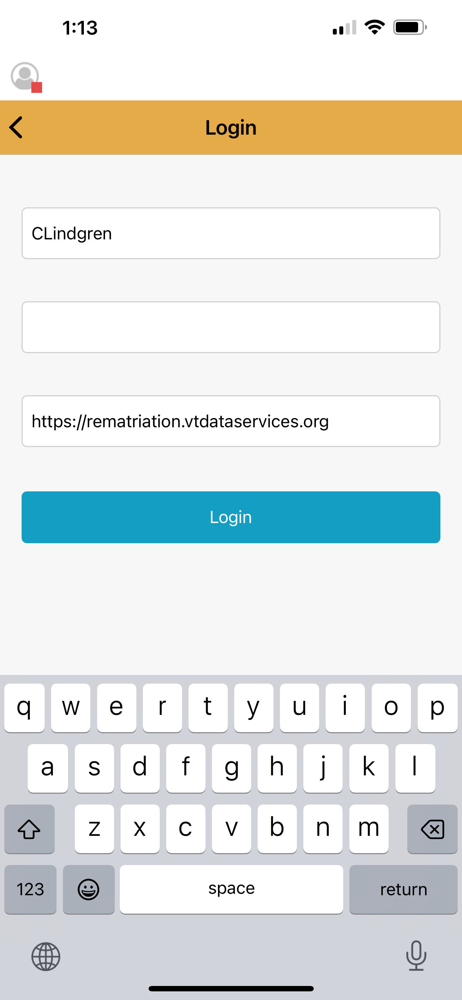Needs 3 info features: username, password, and the URL. The URL may be tricky to deal with at the novice/new user level/situation.<div style="clear:both;margin-bottom:2rem;"></div>
2. 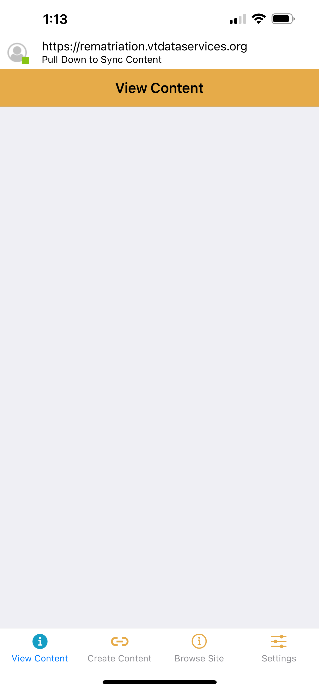Once logged in, this was the first view: an empty screen. This may be different with different settings.<div style="clear:both;margin-bottom:2rem;"></div>

## Create Community Group

[Watch video of process to "Create Community Group"](UI/browser-larger-screen/comm-group-add-member-attempt.mp4): Hard to know how to join, but can easily do so on the user end. But, it errored out. See the video.

<video controls style="width: 620px; height:620px">
  <source src="UI/browser-larger-screen/comm-group-add-member-attempt.mp4" type="video/mp4" />
</video>

### "Create Community" Screenshots

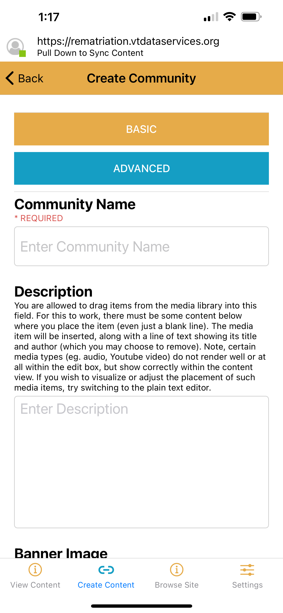1. Initial fold of the mobile screen seen after selecting Create Community Group.
<div style="clear:both;margin-bottom:2rem;"></div>
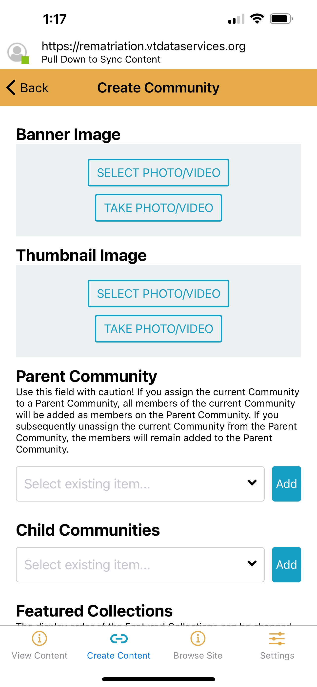2. Second fold of the screen seen after selecting Create Community Group.
<div style="clear:both;margin-bottom:2rem;"></div>
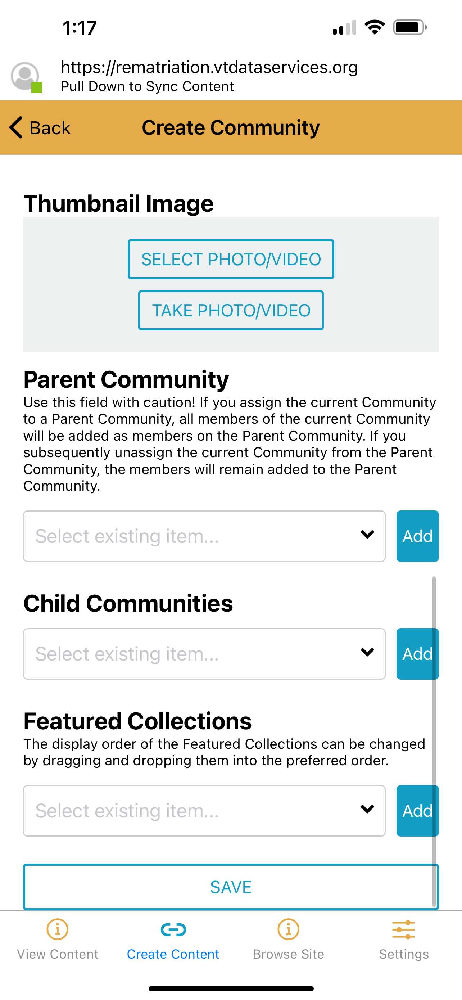3. Last fold of the screen with SAVE button.
<div style="clear:both;margin-bottom:2rem;"></div>

**ERROR Experienced on SAVE**: Admin has a strange process and errors out too at times, but the request seems to go through.
- Error Message content:

    ```pre
    An AJAX HTTP error occurred. HTTP Result Code: 200 Debugging information follows. Path: /batch?render=overlay&id=10&op=finished&op=do StatusText: OK ResponseText: {"status":true,"percentage":"100","message":"Initializing.\u003Cbr\/\u003E\u0026nbsp;\u003Cbr \/\u003E"} @import url("https://rematriation.vtdataservices.org/modules/system/system.base.css?ss954t"); @import url("https://rematriation.vtdataservices.org/modules/system/system.menus.css?ss954t"); @import url("https://rematriation.vtdataservices.org/modules/system/system.messages.css?ss954t"); @import url("https://rematriation.vtdataservices.org/modules/system/system.theme.css?ss954t"); @import url("https://rematriation.vtdataservices.org/sites/all/libraries/mediaelement/build/mediaelementplayer.min.css?ss954t"); @import url("https://rematriation.vtdataservices.org/modules/overlay/overlay-child.css?ss954t"); @import url("https://rematriation.vtdataservices.org/modules/comment/comment.css?ss954t"); @import url("https://rematriation.vtdataservices.org/modules/field/theme/field.css?ss954t"); @import url("https://rematriation.vtdataservices.org/sites/all/modules/contrib/fitvids/fitvids.css?ss954t"); @import url("https://rematriation.vtdataservices.org/sites/all/modules/contrib/geofield_gmap/geofield_gmap.css?ss954t"); @import url("https://rematriation.vtdataservices.org/sites/all/modules/custom/features/ma_scald/css/scald_mukurtu_custom.css?ss954t"); @import url("https://rematriation.vtdataservices.org/sites/all/modules/contrib/scald/modules/fields/mee/css/editor-global.css?ss954t"); @import url("https://rematriation.vtdataservices.org/modules/node/node.css?ss954t"); @import url("https://rematriation.vtdataservices.org/sites/all/modules/contrib/scald_file/scald_file.css?ss954t"); @import url("https://rematriation.vtdataservices.org/modules/search/search.css?ss954t"); @import url("https://rematriation.vtdataservices.org/modules/user/user.css?ss954t"); @import url("https://rematriation.vtdataservices.org/sites/all/modules/contrib/views/css/views.css?ss954t"); @import url("https://rematriation.vtdataservices.org/sites/all/modules/contrib/colorbox/styles/default/colorbox_style.css?ss954t"); @import url("https://rematriation.vtdataservices.org/sites/all/modules/contrib/ctools/css/ctools.css?ss954t"); @import url("https://rematriation.vtdataservices.org/sites/all/modules/custom/mukurtu_splash/mukurtu_splash.css?ss954t"); @import url("https://rematriation.vtdataservices.org/sites/all/modules/contrib/panels/css/panels.css?ss954t"); @import url("https://rematriation.vtdataservices.org/themes/seven/reset.css?ss954t"); @import url("https://rematriation.vtdataservices.org/themes/seven/style.css?ss954t");
    ```

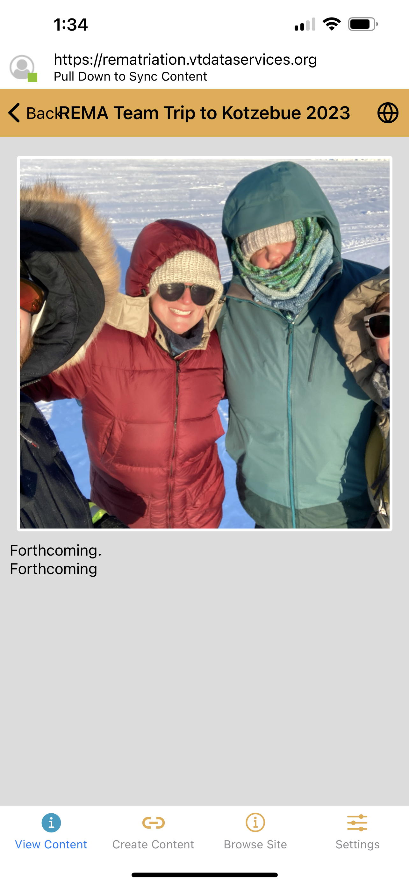4. Initial screen fold after submitting.<div style="clear:both;margin-bottom:2rem;"></div>

## Mobile Needs Content Prioritization Scheme

Currently the landing page on the mobile app displays too many menus, due to no progressive disclosure content strategy. New and moderate users will have trouble comprehending and then navigating the UI since all features are shown all at once.

<div style="display: flex; flex: 0 1 100px">
  <div>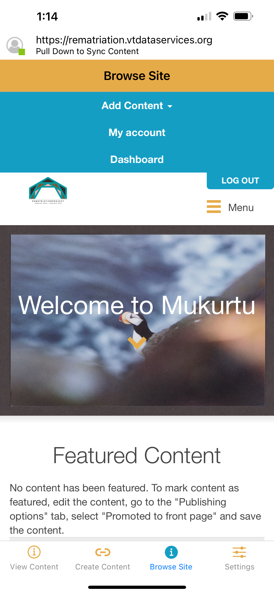</div>
  <div>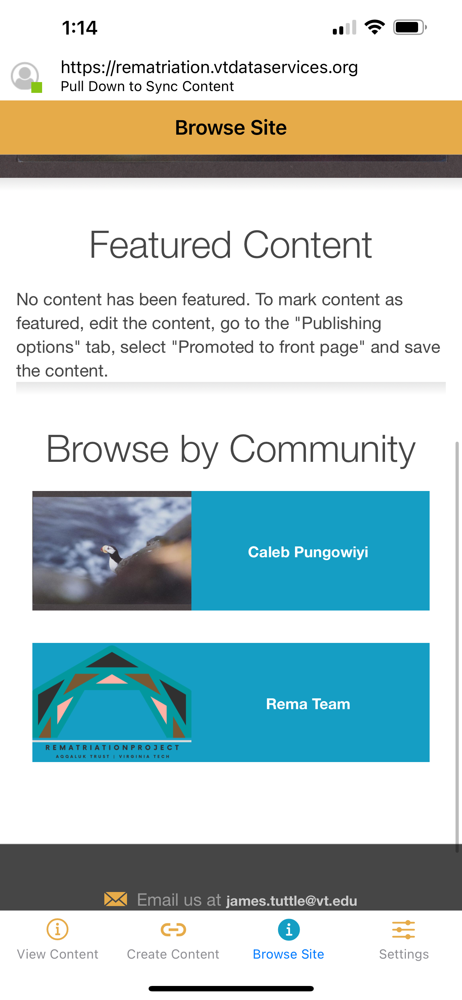</div>
  <div>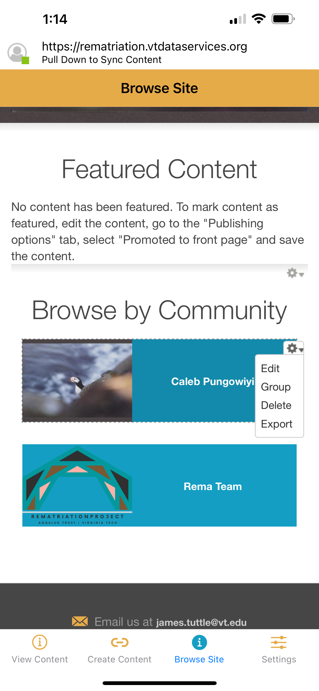</div>
  <div>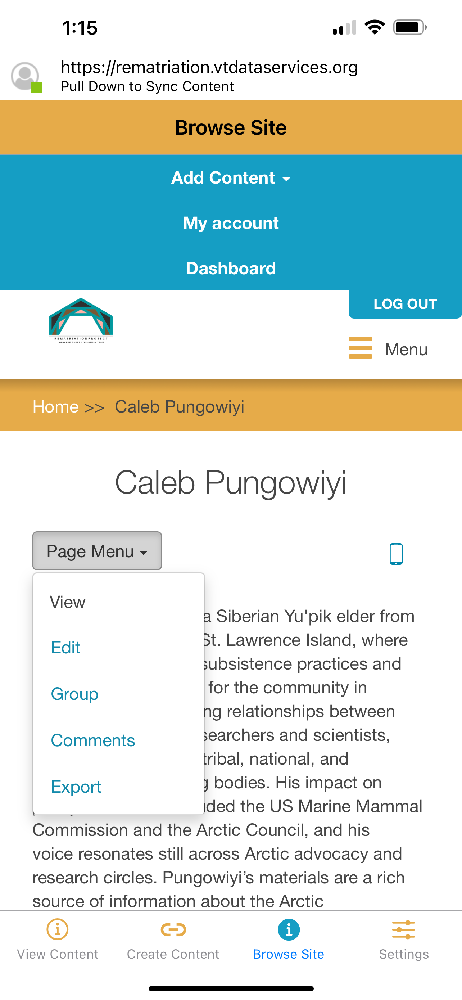</div>
  <div>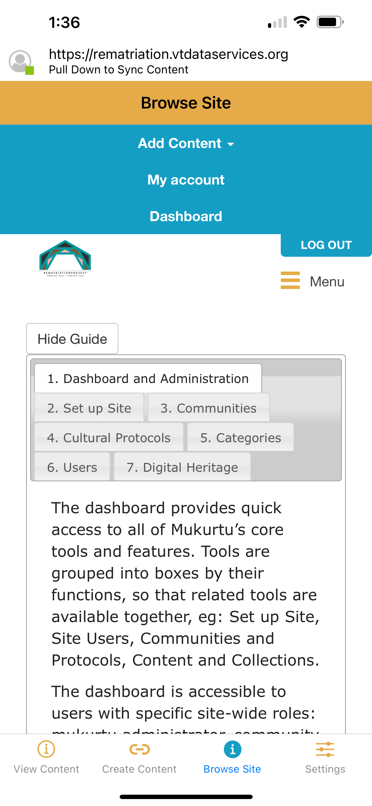</div>
  <div>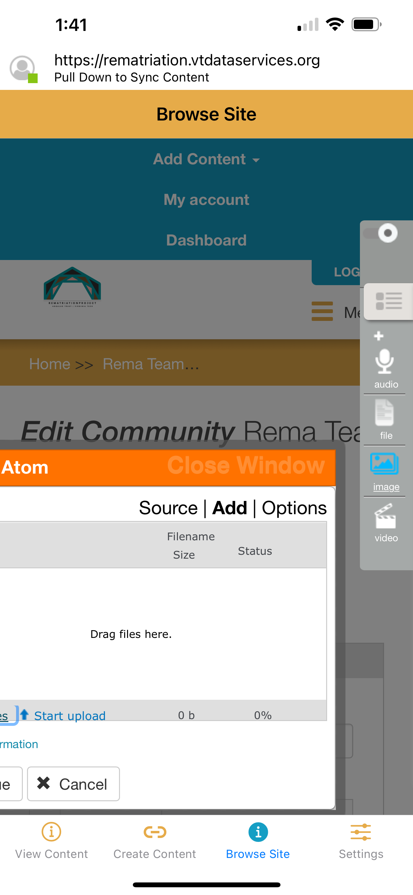</div>
</div>

## IMAGES -- Add New Content

- UI design assumes large > larger screens, since menus become overbearing and pop-up windows break viewport.
- Assumes desktop/laptop with language like "Drag files here"
- Liked how I could use Apple's iOS to review my Photo Library. Nice!
- Could batch upload, but it wasn't completely clear with the available UX writing and lack of embedded docs.
- Could not upload pictures due to size. Seems like the CMS should resize them upon upload, if the images are too large, rather than failing out with an error message that leads to no helpful guidance about next steps or alternatives. Additionally, if a resizing feature is implemented, then I would want to know, so I don't delete an image on my phone if I want to keep the OG large resolution version.

## Personal Collections

- I like this idea! Folks can MySpace it up, if they so choose.
- Can add Relations
- Can set to public or private
- PCs can also include Cultural Protocols for further permissions on the content

## Issues

- Create Content > Lesson: Would auto return to home. After three tries, it crashed the app.
- Embedded docs can be:
  1. too long, and
  2. too technical.
    - **EXAMPLE**: under Personal Collection, the privacy notice is a long paragraph with some HTML in the first sentence: "Personal Collections are listed on your ```<a href="/user">```user profile page```</a>```. ..."